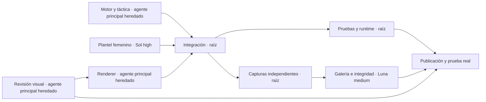

# Ejecución en paralelo · V8

Se usan hasta cuatro agentes activos simultáneos, contando la raíz. Los mensajes habilitan dependencias; no hace falta esperar toda una rama para empezar las independientes. Los agentes comparten checkout con archivos asignados. Sólo la raíz integra y publica.

## Criterio de modelos

- Modelo principal heredado: física, animación, integración y juicio visual. Exigen coherencia entre estado, geometría y reglas.
- GPT-5.6 Sol, high: investigación primaria y plantel femenino estructurado. Contrato acotado en un módulo nuevo.
- GPT-5.6 Luna, medium: escaneo de artefactos, índice HTML y hashes de integridad. Trabajo verificable con entradas/salidas concretas.

## Propiedad de archivos

| Rama | Archivos | Cierre |
| --- | --- | --- |
| Motor/táctica | game/physics.ts y pruebas, PHYSICS-V8.md | 73 pruebas del motor y muestras de vuelo real |
| Plantel | game/women-roster.ts, WOMEN-ROSTER.md | cuatro parejas, ocho perfiles y fuentes |
| Renderer | game/renderer.ts, tipos de player-profiles, RENDERER-V8.md | bancos y modelos visibles en capturas |
| Revisión | PADEL-REVIEW-V8.md y evidencia local | defectos concretos aprobados o registrados |
| Galería | scripts/review-gallery.mjs | índice sin alterar videos, tamaño y SHA256 |
| Raíz | interfaz, circuit-roster, demo, grabador, integración y despliegue | prueba de UI publicada y videos nuevos |

La instrucción de conservar videos está en REVIEW-VIDEOS.md. Las tomas se agregan; nunca se reemplazan.
